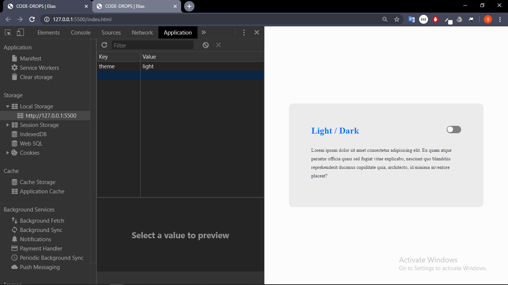
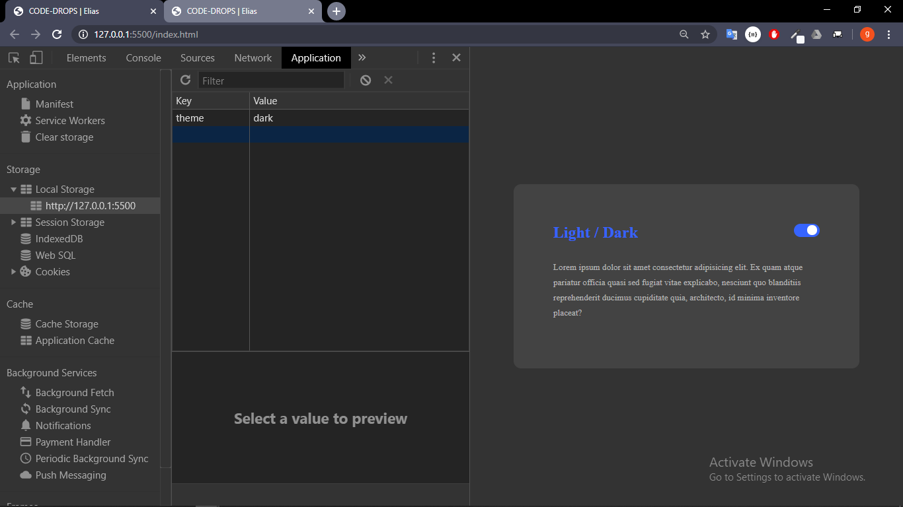

# Themes (DARK | LIGHT) com HTML CSS e JS

> continuação\* guardando valores do thema no **localstorage**

- Com estado

- light
  

- Dark
  

---

author: [elias alexandre](https://github.com/eliasallex)
créditos: [Mayk brito]()
